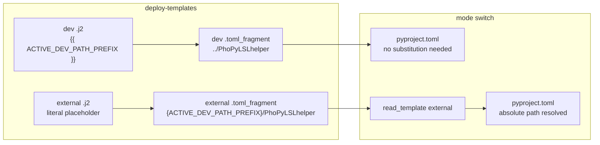

# Dev vs External ACTIVE_DEV_PATH_PREFIX Handling

## Current behavior (incorrect split)

Both [pyproject_template_dev.toml_fragment.j2](src/uv_deps_switcher/templates/pyproject_template_dev.toml_fragment.j2) and [pyproject_template_external.toml_fragment.j2](src/uv_deps_switcher/templates/pyproject_template_external.toml_fragment.j2) emit the literal string `{ACTIVE_DEV_PATH_PREFIX}` in deployed fragments. [render_template()](src/uv_deps_switcher/main.py) passes `ACTIVE_DEV_PATH_PREFIX=path_prefix` to Jinja, but neither template uses `{{ ACTIVE_DEV_PATH_PREFIX }}`, so deploy-time substitution never happens.

Runtime substitution for **both** modes happens in [read_template()](src/uv_deps_switcher/main.py):

```384:384:src/uv_deps_switcher/main.py
        processed_content = template_content.replace("{ACTIVE_DEV_PATH_PREFIX}", path_prefix)
```

The existing test `test_render_dev_template_preserves_runtime_placeholder` encodes the old (undesired) dev behavior.

## Target behavior



| Stage | Dev template | External template |
|-------|--------------|-------------------|
| **J2 source** | `../{{ ACTIVE_DEV_PATH_PREFIX }}PhoPyLSLhelper` | `{ACTIVE_DEV_PATH_PREFIX}/PhoPyLSLhelper` (unchanged) |
| **After deploy-templates** | Concrete path prefix baked in (default: `../PhoPyLSLhelper`) | Placeholder preserved in `templating/` file |
| **After mode switch** | Used as-is from deployed fragment | `read_template()` replaces placeholder via env / `--checkout-dest` / auto-detect |

## Code changes

### 1. Dev J2 template — use Jinja variable

In [pyproject_template_dev.toml_fragment.j2](src/uv_deps_switcher/templates/pyproject_template_dev.toml_fragment.j2), replace every `{ACTIVE_DEV_PATH_PREFIX}` with `{{ ACTIVE_DEV_PATH_PREFIX }}` (9 occurrences), e.g.:

```jinja
phopylslhelper = { path = "../{{ ACTIVE_DEV_PATH_PREFIX }}PhoPyLSLhelper", editable = true }
```

External J2 file stays as-is (literal `{ACTIVE_DEV_PATH_PREFIX}` is correct — Jinja ignores it).

### 2. Clarify render paths in main.py

In [main.py](src/uv_deps_switcher/main.py), split rendering intent so external deploy cannot accidentally substitute the prefix:

- **`generate_dev_template`**: render with `ACTIVE_DEV_PATH_PREFIX=get_active_dev_path_prefix(project_path)` (existing default — empty string unless env is set at deploy time).
- **`generate_external_template`**: render with **only** `include_deps` — do not pass `ACTIVE_DEV_PATH_PREFIX` to Jinja.

Minimal approach: add an optional parameter to `render_template(..., substitute_path_prefix: bool = True)` and pass `False` from `generate_external_template`, or inline two small render calls. Either is fine; the key is external must not receive the Jinja variable.

`read_template()` stays unchanged — it still replaces `{ACTIVE_DEV_PATH_PREFIX}` at runtime for **external** (and for **legacy dev** fragments that still contain the placeholder).

### 3. Tests — [tests/test_path_prefix.py](tests/test_path_prefix.py)

- **Rename/update** `test_render_dev_template_preserves_runtime_placeholder` → assert deploy-time substitution:
  - Expect `path = "../PhoPyLSLhelper"` (empty prefix default)
  - Assert `{ACTIVE_DEV_PATH_PREFIX}` is **not** in output
- **Add** `test_render_external_template_preserves_runtime_placeholder`:
  - Assert `path = "{ACTIVE_DEV_PATH_PREFIX}/PhoPyLSLhelper"` in rendered output
- **Keep** `test_read_template_dev_uses_empty_default_prefix` — still validates backward compatibility for old deployed dev fragments that retain the placeholder

### 4. README — [README.md](README.md)

Update the "Environment Variable Support" and "Deploy Templates" sections (~lines 78–103, 177–187) to reflect:

- **Dev** fragment: prefix resolved when running `deploy-templates` (via `ACTIVE_DEV_PATH_PREFIX` env at deploy time); deployed file contains concrete relative paths.
- **External** fragment: keeps `{ACTIVE_DEV_PATH_PREFIX}` placeholder; resolved at mode-switch time (`external` mode auto-detect, env, or `--checkout-dest`).

Remove/adjust the statement that both dev and external fragments keep the placeholder.

## Verification

Run:

```bash
python -m unittest tests.test_path_prefix
uv-deps-switcher deploy-templates --dry-run   # from a project with pyproject.toml
```

Confirm dry-run dev output has no `{ACTIVE_DEV_PATH_PREFIX}` and external output still does.

## Scope note

No change to `read_template()` logic beyond optional comment — backward compatible with existing deployed dev templates that still contain the placeholder.
