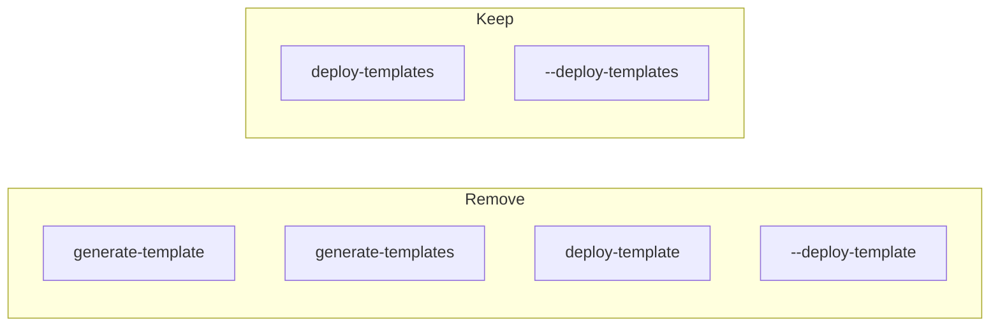

# Remove generate-templates aliases

## Scope

All changes are in [`src/uv_deps_switcher/main.py`](src/uv_deps_switcher/main.py). No other files under `src/` reference the removed aliases.

## Current CLI surface (deploy templates)



## Changes in `main()`

**1. Narrow accepted entry points** (~lines 936–940)

Replace the alias set:

```python
deploy_template_subcommands = {"deploy-template", "deploy-templates", "generate-template", "generate-templates"}
```

with:

```python
deploy_template_subcommands = {"deploy-templates"}
```

**2. Rename the flag** (~lines 939–945)

- `is_deploy_template_flag`: check for `"--deploy-templates"` instead of `"--deploy-template"`
- Error message: `--deploy-templates does not accept additional arguments`
- `deploy_prog`: `"uv-deps-switcher --deploy-templates"` when invoked via flag

**3. Update help epilog** (~lines 993–995)

- Keep: `uv-deps-switcher deploy-templates`
- Remove: `uv-deps-switcher generate-templates` alias line
- Update: `uv-deps-switcher --deploy-template` → `uv-deps-switcher --deploy-templates`

**4. Leave error hints unchanged**

Existing hints at lines 1095 and 1117 already point to `uv-deps-switcher deploy-templates`, which remains valid:

```1095:1095:src/uv_deps_switcher/main.py
                print("Hint: cd to a UV project (with pyproject.toml) and run `uv-deps-switcher deploy-templates` to set up.", file=sys.stderr)
```

**5. Comment cleanup**

Update the block comment from "Handle deploy-template aliases separately" to reflect the slimmer interface (e.g. "Handle deploy-templates command").

## Out of scope (optional follow-up)

[`README.md`](README.md) still documents removed forms (`generate-templates`, `--deploy-template`). Not in `@src`, but worth updating separately for doc parity:

- Remove `uv-deps-switcher generate-templates`
- Change `uv-deps-switcher --deploy-template` → `uv-deps-switcher --deploy-templates`

## Verification

Manual smoke checks after edit:

```bash
uv-deps-switcher deploy-templates --dry-run          # should work
uv-deps-switcher --deploy-templates --dry-run        # should work (renamed flag)
uv-deps-switcher generate-templates                  # should fall through to mode parser / error
uv-deps-switcher deploy-template                     # same
uv-deps-switcher --deploy-template                   # same
```

No automated tests cover CLI aliases today; no new tests unless you want them.
